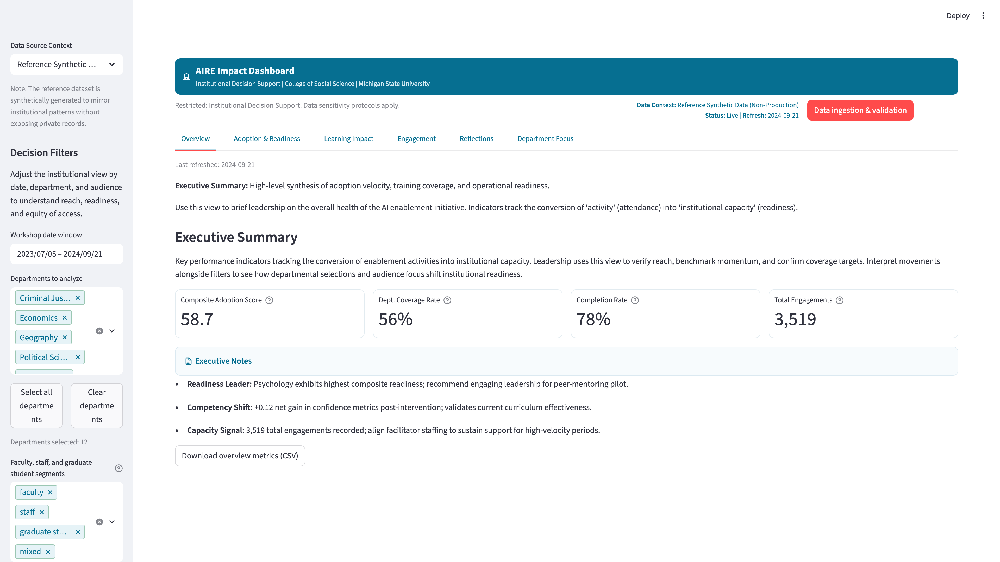
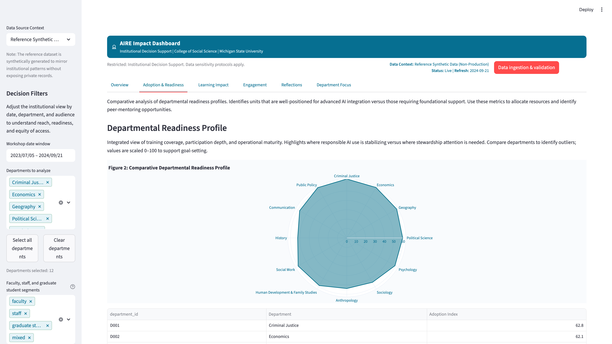
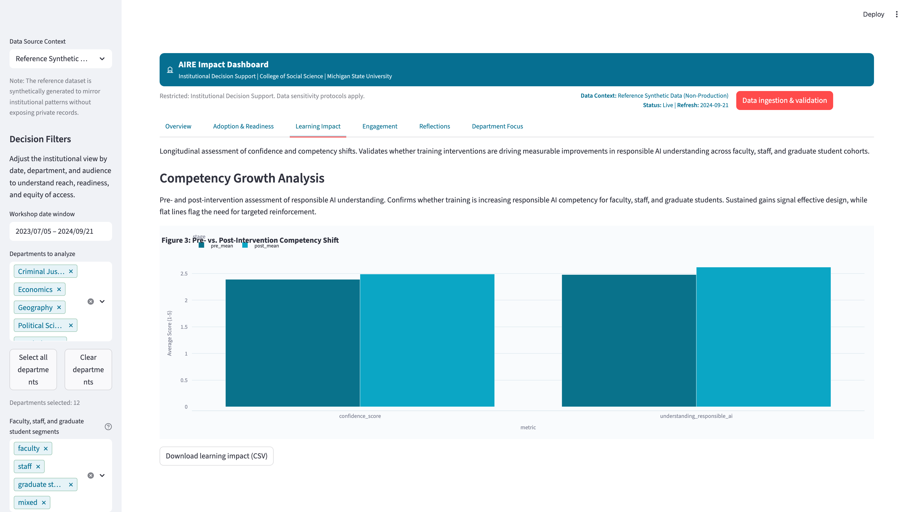
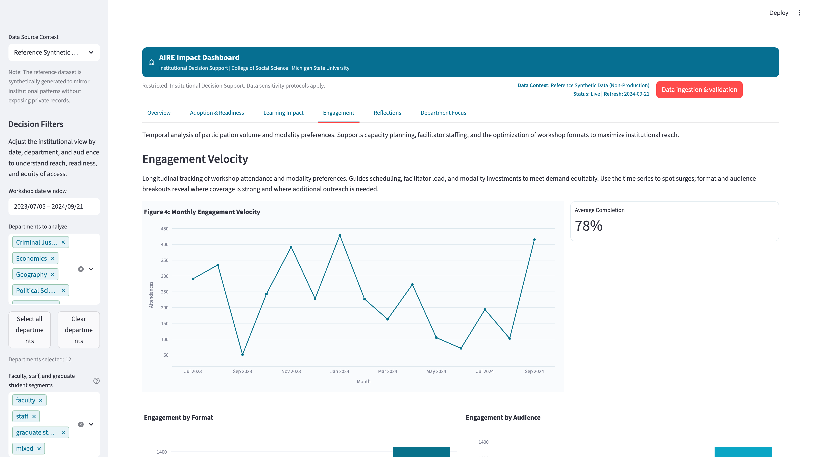
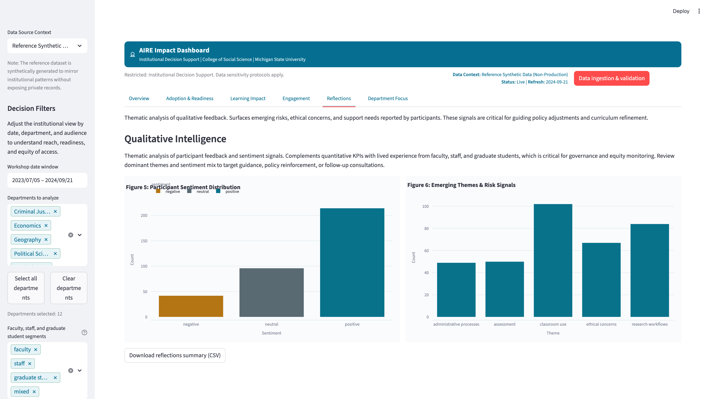
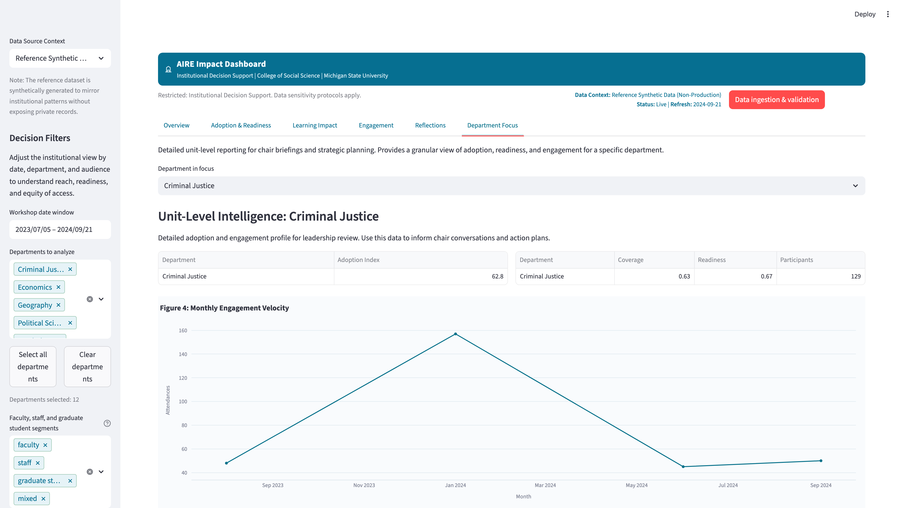

# AIRE Impact Dashboard  

The AIRE Impact Dashboard is the institutional analytics layer of the Applied AI Innovation and Research Enablement (AIRE) Program. It provides leadership and program staff with a clear view of how AI literacy, confidence, participation, and readiness are developing across the college. The dashboard was originally deployed on internal MSU systems and used securely governed datasets. This public version mirrors the structure and analytical logic of the internal deployment while relying entirely on synthetic data.

The Impact Dashboard helps connect the activities of the AIRE Literacy Hub, the AIRE Researcher Sandbox, and the AIRE Personalization Layer to institutional planning. It presents a structured set of indicators that support ongoing conversations about responsible adoption, professional development, and the readiness of units for deeper AI-related work.

## Role in the AIRE Ecosystem

The AIRE Program includes four coordinated components:

- AIRE Literacy Hub  
- AIRE Researcher Sandbox  
- AIRE Impact Dashboard  
- AIRE Personalization Layer (Micro Tutor and Learner Scorecard)

Within this structure, the Impact Dashboard serves as the primary decision-support environment. It helps leadership track:

- participation patterns across faculty, staff, students, and researchers  
- changes in self-reported confidence and understanding of responsible AI practice  
- emerging strengths and areas where additional support may be needed  
- differences in adoption and readiness across departments  
- themes from reflections and other qualitative feedback  
- indicators that help with planning, accreditation needs, and resource allocation  

The dashboard provides a stable reference point for understanding how the college’s capacity for responsible AI use is developing over time.

## What the Dashboard Shows

The dashboard is organized into several views that work together to present a balanced picture of institutional progress.

### Overall Program Picture  
A summary showing participation levels, shifts in confidence, readiness patterns, and basic indicators of adoption. This view provides context for the rest of the dashboard.

### Departmental Adoption and Readiness  
A comparative view that illustrates how units differ in training coverage, participation, and readiness for deeper AI integration. This helps identify departments that may require additional mentoring or support.

### Learning Outcomes and Confidence Growth  
Pre- and post-training confidence measures indicating whether participants feel better prepared to use AI tools and understand responsible-use expectations.

### Participation and Engagement Trends  
A time-based view that shows how individuals interact with workshops and microcourses across semesters. These patterns help program staff anticipate demand and refine scheduling.

### Reflections and Emerging Themes  
Synthetic qualitative feedback that models how participants reflect on workshops and training. These themes help inform program improvements and identify areas where new materials or consultations may be helpful.

### Department Readiness Matrix  
A combined view that compares readiness indicators and training coverage. This model helps units understand their position in the college’s overall AI adoption landscape.

All views can be filtered by department, role, or timeframe to support detailed examination.

## Synthetic Data and Public Transparency

To make this dashboard publicly accessible, the GitHub version uses synthetic data. The datasets have been designed to:

- resemble the structure and statistical patterns of the internal datasets  
- illustrate typical adoption behavior across a large academic unit  
- support realistic demonstrations of indicators, filters, and visualizations  
- maintain confidentiality and remove any possibility of identifying real individuals  

This approach allows institutions, researchers, and instructional design teams to explore the dashboard model, test their own data, or adapt the framework for their own environments.

## Uploading Data for Local Exploration

The dashboard includes a Data Management interface for uploading CSV files. Uploaded data is validated against the expected schema, held locally during the session, and used to recompute all indicators and visualizations.

The synthetic dataset remains the default option for immediate use. Schema definitions for each data file can be found in the `schemas/` directory.

## Running the Dashboard Locally

Requires Python 3.9 or higher. A virtual environment is recommended:

    python -m venv .venv
    source .venv/bin/activate  # On Windows: .venv\Scripts\activate

Install dependencies:

    pip install -r requirements.txt

Run the dashboard:

    streamlit run app.py

All views will populate using the synthetic dataset unless users upload their own data through the interface.

## Testing and Continuous Integration

This repository includes a test suite covering schema validation, data integrity, KPI calculations, and import checks.

Run tests with:

    pytest

A GitHub Actions workflow is included for continuous integration.

## Relationship to the Other AIRE Components

The Impact Dashboard links the program's learning, experimentation, and personalization components to institutional planning.

- The AIRE Literacy Hub provides training resources and responsible-use guidance.  
- The AIRE Researcher Sandbox provides workflows for early-stage experimentation.  
- The AIRE Personalization Layer generates learner-facing insights and telemetry patterns.  
- The Impact Dashboard aggregates and summarizes synthetic versions of those signals.  

Together, these components support responsible AI adoption across the college.

## License

MIT License. All synthetic data and demonstration code in this repository are provided as open resources to support transparent and responsible institutional analytics.
